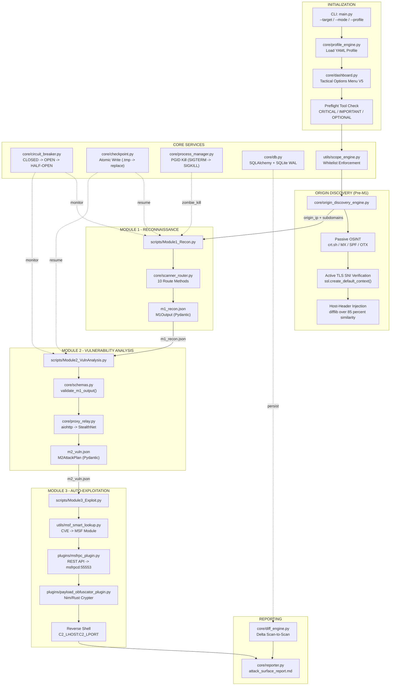
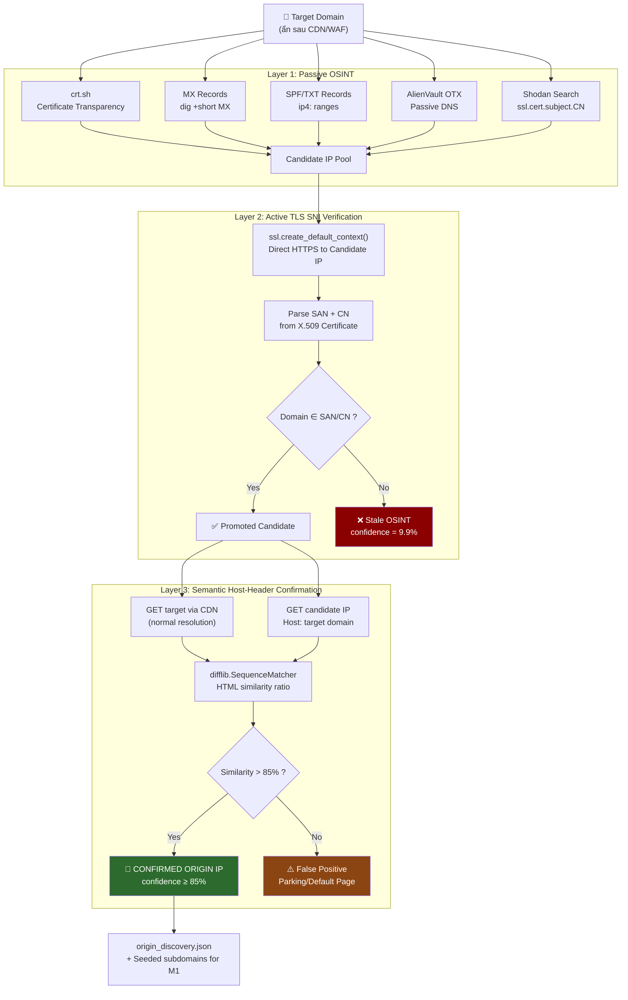
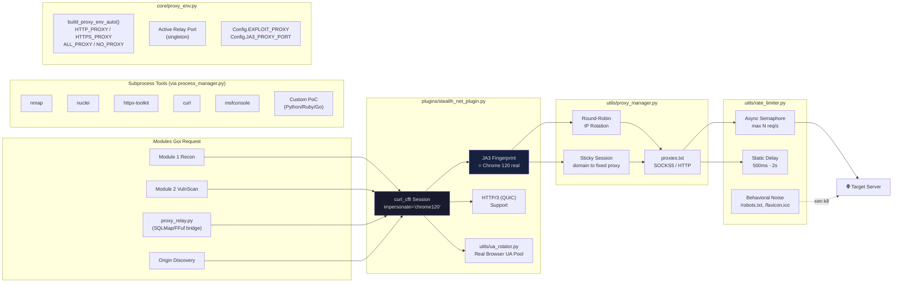
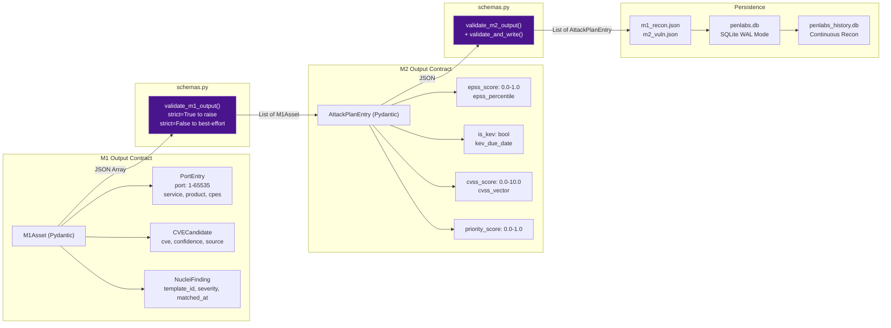
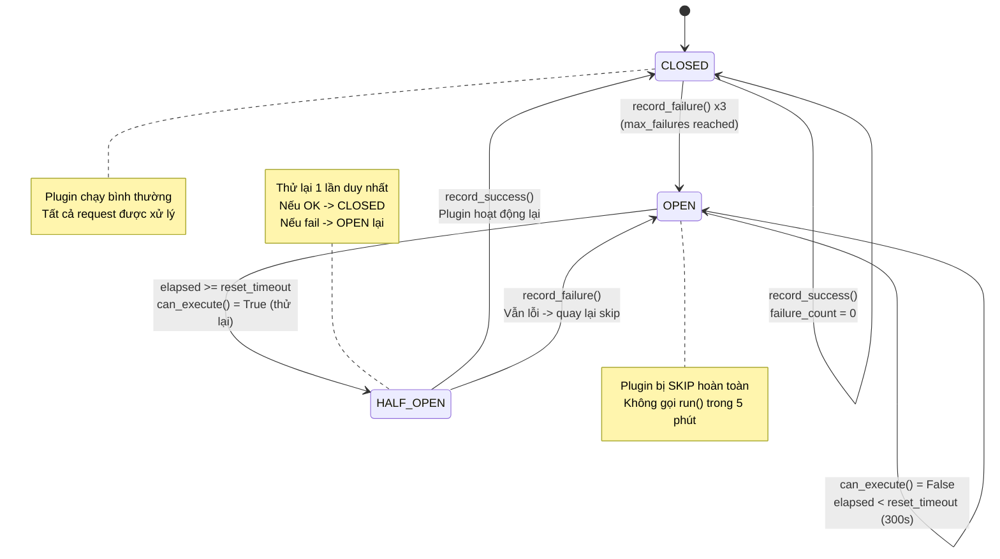
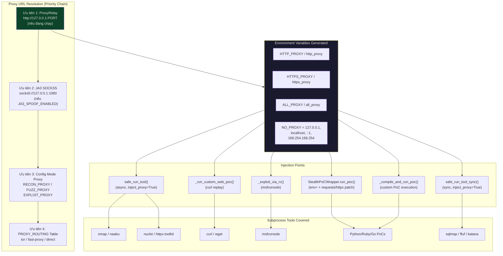

# 🎯 PenLabs V1.0 - Security Automation Engine

**PenLabs V1.0** là một **Security Automation Engine** cho pentest có ủy quyền. Hệ thống kết hợp trinh sát diện rộng (Reconnaissance), phân tích dữ liệu tình báo lỗ hổng (Vulnerability Intelligence), DAST ban đầu, triage finding và report/handoff cho phần manual testing.

Đặc biệt, hệ thống được thiết kế theo tư duy **OPSEC (Operations Security)** với hỗ trợ rate limit, proxy profile theo phase, JA3/TLS proxy option, raw artifacts, normalized contracts và quản lý an toàn vòng đời tiến trình.

>  PenLabs có thể đạt khoảng **70% automation cho recon + initial DAST + triage/report** nếu môi trường cài đủ tool, scope/RoE rõ ràng, auth profile đúng và operator chọn đúng mode/options. Tool **không thay thế 30% manual** cho xác nhận impact, business logic, workflow và report khách hàng.

Tài liệu vận hành chi tiết: [docs/automation_70.md](docs/automation_70.md)

---

## 🛠 Tính Năng Cốt Lõi (Core Features)

- 🕵️ **StealthNet & Proxy Profiles:** Hỗ trợ JA3/TLS proxy option, `RECON_PROXY`, `FUZZ_PROXY`, `EXPLOIT_PROXY`, Tor route tách riêng và rate/delay theo mode.
- 🔒 **Proxy-Aware Subprocess Routing:** Các tool như Nuclei, Katana, SQLMap, Dalfox, WPScan và Nmap nhận proxy/strategy theo mode khi plugin hỗ trợ. Luôn kiểm tra raw command trong `output/.../raw`.
- 🧠 **Cơ chế Kháng False-Positive Kép:** Quét cổng và xác minh chứng chỉ số (TLS SNI Matcher) ngay lập tức kết hợp so sánh ngữ nghĩa (Semantic HTML/DOM Diffing) để loại trừ các hệ thống CDN giả mạo và bắt đúng IP gốc (Origin IP).
- 🔄 **Continuous Reconnaissance (Diff Engine):** Cở sở dữ liệu SQLite tối ưu WAL cho phép theo dõi chu kỳ, tìm ra endpoint mới, subdomain mới, và phát hiện tự động mã nguồn JS bị thay đổi.
- ⚡ **Auto-Exploitation (M3):** Liên kết trực tiếp qua REST API tới daemon của **Metasploit (msfrpcd)** để tự động tra cứu mã CVE sang module exploit, đẩy payload và mở Reverse Shell tự động.
- 🚧 **Safe Process Manager & Circuit Breaker:** Xử lý triệt để các zombie process (như Amass) qua cơ chế cách ly Process Group (PGID). Nếu một plugin quét bị lỗi liên tiếp 3 lần, hệ thống sẽ ngắt mạch (Circuit Breaker) để không làm treo toàn bộ luồng.
- 📌 **Automation Contracts:** `endpoint_store`, `dast_findings`, `verification_buckets`, `strategy_profiles`, `attack_chains`, `cloud_infra_depth` và `dry_run_snapshot` giúp router/report/DB tiêu thụ output thống nhất.
- 🔐 **Auth Context:** Hỗ trợ User A/B, cookie, CSRF extraction và token refresh profile cho BOLA/Mass Assignment/API testing.
- ✅ **Verification Pass 2:** Có thể bật replay HTTP có giới hạn để đẩy finding từ `suspected/manual_review` lên `confirmed` khi RoE cho phép.
- 🧭 **Knowledge-Guided Testing:** Có thể dùng `PENLABS_KNOWLEDGE_BASE` để nối WSTG/CROSSWALK/framework operator cards vào `strategy_profiles`, `wstg_coverage` và `manual_handoff` mà không tự động chạy payload pack thô.
  Fallback hardcoded: `./knowledge-base`, `./data/knowledge-base`, rồi tới path lab cục bộ `/home/tcus/Desktop/WEb/wstg-pentest/knowledge-base`.

---

## 🏗 Cấu Trúc Dự Án (Project Structure)

```text
PenLabs/
├── main.py                  # Điểm khởi chạy chính (Entrypoint) chứa CLI args và TUI Dashboard
├── config.py                # Biến môi trường và cấu hình hệ thống
├── setup.sh                 # Script tự động cài đặt hệ sinh thái công cụ (Go, Rust, Python, MSF)
├── .env                     # File chứa cấu hình API Keys, C2 LHOST, C2 LPORT
├── core/                    # Lõi điều phối (Orchestrator)
│   ├── profile_engine.py    # Phân tích tham số CLI và ánh xạ ra các tactical options
│   ├── scanner_router.py    # Luồng điều phối bất đồng bộ M1 (Recon) -> M2 (Vuln) -> M3 (Exploit)
│   ├── endpoint_store.py    # Canonical endpoint feedback loop giữa crawler/recon và DAST
│   ├── dast_contract.py     # Contract chung cho DAST findings
│   ├── operational_contract.py # Contract recon/cloud/infra findings
│   ├── auth_context.py      # User A/B, cookie, CSRF, token refresh profile
│   ├── verification.py      # Confirmed/Suspected/Manual Review/Noise buckets
│   ├── verification_replay.py # HTTP replay pass 2 cho finding dễ false-positive
│   ├── knowledge_base.py    # Adapter WSTG/technique/framework KB -> strategy/report handoff
│   ├── wordlist_registry.py # Registry wordlist theo mode/purpose cho ffuf/Kiterunner/S3
│   ├── performance.py       # Budget hiệu suất theo mode cho crawler/ffuf/Kiterunner
│   ├── plugin_strategy.py   # Strategy profile cho Nuclei/SQLMap/Dalfox/WPScan/Nmap
│   ├── correlation.py       # Attack path scoring/chaining
│   ├── cloud_infra_depth.py # Triage chiều sâu cloud/infra
│   ├── dry_run_snapshot.py  # Snapshot ổn định cho regression/diff
│   ├── origin_discovery_engine.py # Truy tìm IP thật ẩn sau WAF/CDN
│   ├── nse_killchain.py     # Chuỗi tự động hóa Nmap Scripting Engine
│   ├── process_manager.py   # Quản lý vòng đời tiến trình (Chống zombie process + Auto Proxy Inject)
│   ├── proxy_env.py         # [V2026] Xây dựng biến môi trường proxy tập trung cho subprocess
│   ├── proxy_relay.py       # Cầu nối HTTP Proxy ↔ StealthNet (cho SQLMap, FFuf, curl)
│   ├── schemas.py           # Contract data Pydantic V2 giữa các module
│   ├── recon_db.py          # SQLite database tracking lịch sử quét
│   └── reporter.py          # Biên dịch báo cáo Markdown
├── plugins/                 # Chứa 46+ Plugins giao tiếp với External Tools
│   ├── stealth_net_plugin.py# Module thực hiện HTTP/3 & JA3 Spoofing
│   ├── msfrpc_plugin.py     # Metasploit RPC Bridge
│   ├── katana_plugin.py     # ProjectDiscovery Katana Wrapper
│   └── ...                  # Naabu, Amass, Subfinder, Arjun, Nuclei, Dalfox,...
├── utils/                   # Công cụ hỗ trợ
│   ├── proxy_manager.py     # Phân tải Proxy
│   ├── rate_limiter.py      # Giới hạn Request (Bypass Rate-Limit)
│   └── msf_smart_lookup.py  # AI/Smart Lookup CVE -> MSF Module
├── profiles/                # Chứa file cấu hình YAML định nghĩa luồng quét (stealth, fast, web-vuln)
├── examples/                # Mẫu cấu hình vận hành, gồm auth_profile.example.json
├── docs/                    # Tài liệu vận hành chi tiết
├── data/                    # Dữ liệu tĩnh như MSF Module Map
├── output/                  # Chứa kết quả quét, báo cáo (attack_surface_report.md)
└── wordlists/               # Tàng thư từ điển (Fuzzing, Subdomain, APIs)
```

---

## ⚙️ Kiến Trúc Workflow (Architecture)

Để tối ưu hóa không gian hiển thị và giảm tải thị giác (cognitive load), toàn bộ kiến trúc 7 lớp của **PenLabs V1.0** được tổ chức thành các phân vùng chuyên biệt dưới đây. Nhấp vào mỗi tiêu đề để mở rộng sơ đồ và phân tích chi tiết.

| Phân Vùng Hệ Thống | Cơ Chế Cốt Lõi | Tài Liệu Kỹ Thuật | Sơ Đồ Quy Trình |
| :--- | :--- | :--- | :--- |
| **1. Master Pipeline** | Điều phối Module M1 $\rightarrow$ M2 $\rightarrow$ M3 | `main.py` | [Xem Chi Tiết 🔽](#1-sơ-đồ-điều-phối-tổng-thể-master-orchestration-pipeline) |
| **2. Scanner Router** | 10 Route chiến thuật & Toolchain | `core/scanner_router.py` | [Xem Chi Tiết 🔽](#2-luồng-trinh-sát-chi-tiết--m1-scanner-router) |
| **3. Origin Discovery** | Xác minh Origin IP thực chống CDN/WAF | `core/origin_discovery_engine.py` | [Xem Chi Tiết 🔽](#3-pipeline-chống-false-positive--origin-discovery-engine) |
| **4. StealthNet Engine** | Bypass Fingerprinting & Rate-Limiting | `plugins/stealth_net_plugin.py` | [Xem Chi Tiết 🔽](#4-tầng-mạng-tàng-hình--stealthnet-engine) |
| **5. Plugin Registry** | Singleton Dynamic Discovery | `core/registry.py` | [Xem Chi Tiết 🔽](#5-hệ-thống-plugin--registry) |
| **6. Data Contracts** | Pydantic V2 Schema Validation | `core/schemas.py` | [Xem Chi Tiết 🔽](#6-luồng-dữ-liệu--hợp-đồng-schema-data-flow--contracts) |
| **7. Circuit Breaker** | Chống treo / Đổ vỡ hệ thống dây chuyền | `core/circuit_breaker.py` | [Xem Chi Tiết 🔽](#7-máy-trạng-thái-circuit-breaker) |
| **8. Proxy-Aware Routing** | Proxy env/flag injection cho subprocess được hỗ trợ | `core/proxy_env.py` | [Xem Chi Tiết 🔽](#8-system-wide-proxy-routing) |

---

## ⚔️ Tactical Modes & Automation Coverage

| Mode | Mục đích | Automation thực tế |
| :--- | :--- | ---: |
| `asset-discovery` | Subdomain, live URL, JS, API endpoint, secrets, exposure | 70-80% |
| `web-vuln` | Web DAST ban đầu: Nuclei, Dalfox, CORS, Blind XSS, Mass Assignment | 60-75% |
| `api-bounty` | Full web/API bounty pipeline: crawler, API routes, Arjun, SQLMap detect-only, SSRF, BOLA, GraphQL, WPScan | 60-75% |
| `api-breach` | Origin/API exposure, hidden params, Nuclei API/misconfig | 55-70% |
| `cloud-native` | S3/GCP/Azure, K8s, takeover, cloud templates | 50-70% |
| `infra-smash` | Passive ports, Naabu/Nmap, NSE, infra triage | 55-70% |
| `sniper` | Một target chính, quét gọn | 55-70% |
| `stealth` | Low-noise external recon | 45-65% |
| `full-audit` | Coverage sâu, noise cao | 60-75% nếu đủ tool |

Kết quả automation phụ thuộc lớn vào scope, tool external, auth, WAF/rate limit và cấu hình option. Bucket `manual_review` vẫn cần tester xử lý.

---

## 📚 Wordlist Registry

PenLabs tự chọn wordlist qua `core/wordlist_registry.py`:

| Purpose | Auto dùng bởi | Default |
| :--- | :--- | :--- |
| `web_content` | `ffuf` directory/file discovery | `wordlists/common.txt` |
| `web_content_stealth` | `ffuf` khi mode `stealth`/`sniper` | `wordlists/sensitive_paths_2026.txt` |
| `web_content_deep` | `ffuf` khi mode `full-audit`/`infra-smash` | `wordlists/raft-large-directories.txt` |
| `api_routes` | Kiterunner | `wordlists/routes-small.kite` |
| `api_params` | Reserved cho Arjun/param workflows | `wordlists/params.txt` |
| `s3_buckets` | S3Scanner | `wordlists/s3_buckets.txt` |
| `passwords` | Reserved, không auto brute-force | `wordlists/top-10000-passwords.txt` |

Override nếu cần:

```bash
export PENLABS_WEB_WORDLIST=/path/to/common.txt
export PENLABS_WEB_DEEP_WORDLIST=/path/to/raft-large-directories.txt
export KITERUNNER_WORDLIST=/path/to/routes.kite
export PENLABS_PARAM_WORDLIST=/path/to/params.txt
export PENLABS_S3_WORDLIST=/path/to/s3_buckets.txt
```

`passwords` cố ý không auto-enable để tránh lockout/noise; chỉ plugin nào có RoE rõ mới được gọi có chủ đích.

---

## ⚡ Performance Budget

`core/performance.py` đặt budget theo tactical mode để tránh chạy “mạnh ai nấy bắn”. Các stage vẫn nối tiếp theo pipeline, nhưng target độc lập trong cùng stage như Katana/ffuf được chạy song song có giới hạn.

| Env override | Tác dụng |
| :--- | :--- |
| `PENLABS_FFUF_TARGETS` | Số host unique tối đa cho ffuf trong một stage |
| `PENLABS_FFUF_CONCURRENCY` | Số worker ffuf chạy song song |
| `PENLABS_FFUF_THREADS` | Giá trị `ffuf -t` |
| `PENLABS_FFUF_RATE` | Giá trị `ffuf -rate` khi không ở stealth |
| `PENLABS_FFUF_TIMEOUT` | Timeout mỗi ffuf process |
| `PENLABS_CRAWLER_CONCURRENCY` | Số Katana crawl chạy song song trong batch |
| `PENLABS_KITERUNNER_TARGETS` | Số host unique tối đa đưa vào Kiterunner |
| `PENLABS_NMAP_MSF_SYNC` | Bật sync Nmap -> MsfRPC khi thật sự cần, mặc định `false` |

Giữ mặc định nếu chưa có RoE rõ. Khi target yếu hoặc có WAF/rate-limit, giảm concurrency/rate trước; khi audit nội bộ được phép noise cao, tăng `PENLABS_FFUF_TARGETS` và `PENLABS_CRAWLER_CONCURRENCY` có kiểm soát.

Benchmark/active-only flags:

```bash
python3 main.py <target> --mode sniper --no-osint --no-stealth-discovery --no-subdomain-scan
```

Các flag này giúp đo scanner core hoặc chạy low-noise hơn: bỏ OSINT passive, WAF/subdomain passive discovery và recursive subdomain scan. Mặc định của tool không đổi.

---

## 📦 Normalized Output Contracts

Các mode chính đều cố gắng trả về các field chuẩn sau:

| Contract | Ý nghĩa |
| :--- | :--- |
| `endpoint_store` | Kho endpoint hợp nhất từ web URLs, parameterized URLs, Katana, LinkFinder, Kiterunner, Arjun |
| `api_endpoints` | Endpoint API/parameterized đã lọc để DAST/manual dùng tiếp |
| `dast_findings` | Finding DAST chuẩn hóa chung cho bounty/web-vuln |
| `verification_buckets` / `verification_summary` | `confirmed`, `suspected`, `manual_review`, `noise` |
| `strategy_profiles` | Strategy thực thi cho Nuclei, SQLMap, Dalfox, WPScan, Nmap |
| `wordlist_profile` | Wordlist được chọn tự động theo mode/purpose, gồm source/path để audit |
| `knowledge_profile` / `wstg_coverage` | Technique codes, WSTG refs, framework hints và coverage gaps từ knowledge-base |
| `manual_handoff` | Queue việc manual 30% theo finding/gap, kèm guide path và next step |
| `attack_chains` | Correlated attack paths có `score` và manual next step |
| `cloud_infra_depth` | High-value services, cloud counts và triage items |
| `dry_run_snapshot` | Snapshot count-based ổn định cho regression/diff |

---

### 1. Sơ Đồ Điều Phối Tổng Thể (Master Orchestration Pipeline)

<details>
<summary><b>🔍 Click để xem: Sơ Đồ Master Orchestration Pipeline</b></summary>

Luồng xử lý chính đi từ `main.py` qua 3 module kịch bản (`Module1_Recon.py` → `Module2_VulnAnalysis.py` → `Module3_Exploit.py`), được giám sát bởi Circuit Breaker và Checkpoint Manager.


</details>

---

### 2. Luồng Trinh Sát Chi Tiết — M1 Scanner Router

<details>
<summary><b>📡 Click để xem: Cơ Chế Scanner Router & Phân Nhóm Công Cụ</b></summary>

`scanner_router.py` chứa **10 route methods** bất đồng bộ, mỗi route tương ứng một chiến thuật quét. Route được chọn dựa trên `--mode` flag.

```mermaid
graph TB
    subgraph MODES["Mode Selection"]
        AD["asset-discovery"]
        CN["cloud-native"]
        IS["infra-smash"]
        SN["sniper"]
        FA["full-audit"]
        WV["web-vuln"]
        AB["api-breach"]
        %% Khác
        ST["stealth"]
        CD["cloud-devops"]
        APB["api-bounty"]
    end

    subgraph RECON["Recon Tool Chain"]
        SUB["subfinder"]
        HTX["httpx-toolkit"]
        KAT["katana"]
        NAA["naabu"]
        NMP["nmap"]
        NUC["nuclei"]
        %% Khác
        AMA["amass"]
        GAU["gau"]
    end

    subgraph VULN["Web Vuln Plugins"]
        DAL["dalfox_plugin"]
        COR["corsy_plugin"]
        ARJ["arjun_plugin"]
        SQL["sqlmap_plugin"]
        %% Khác
        CRLF["crlf_plugin"]
        SSRF["ssrf_plugin"]
        BOLA["bola_plugin"]
        BXSS["blind_xss_plugin"]
    end

    subgraph INTEL["Intelligence"]
        NVD["nvd_plugin"]
        EPS["epss_plugin"]
        KEV["kev_plugin"]
        %% Khác
        SHO["shodan_plugin"]
        VT["virustotal_plugin"]
    end

    %% Mappings
    AD --> SUB
    AD --> HTX
    AD --> KAT
    AD --> NUC

    CN --> SUB
    CN --> HTX
    CN --> NUC

    IS --> NAA
    IS --> NMP
    IS --> NUC

    SN --> NAA
    SN --> NMP
    SN --> HTX
    SN --> NUC

    FA --> NAA
    FA --> NMP
    FA --> HTX
    FA --> KAT
    FA --> NUC

    WV --> HTX
    WV --> KAT
    WV --> NUC
    WV --> DAL
    WV --> COR

    AB --> KAT
    AB --> NUC
    AB --> ARJ
    AB --> SQL

    NUC --> NVD
    NUC --> EPS
    NUC --> KEV

    %% Styling
    classDef mode fill:#1e3a8a,stroke:#3b82f6,stroke-width:2px,color:#fff;
    classDef tool fill:#064e3b,stroke:#10b981,stroke-width:2px,color:#fff;
    classDef vuln fill:#7f1d1d,stroke:#ef4444,stroke-width:2px,color:#fff;
    classDef intel fill:#4a044e,stroke:#d946ef,stroke-width:2px,color:#fff;
    classDef floating fill:#374151,stroke:#6b7280,stroke-width:1px,color:#9ca3af,stroke-dasharray: 5 5;

    class AD,CN,IS,SN,FA,WV,AB mode;
    class ST,CD,APB floating;
    
    class SUB,HTX,KAT,NAA,NMP,NUC tool;
    class AMA,GAU floating;
    
    class DAL,COR,ARJ,SQL vuln;
    class CRLF,SSRF,BOLA,BXSS floating;
    
    class NVD,EPS,KEV intel;
    class SHO,VT floating;
```


</details>

---

### 3. Pipeline Chống False-Positive — Origin Discovery Engine

<details>
<summary><b>🌐 Click để xem: Quy Trình Origin Discovery 3 Lớp</b></summary>

`origin_discovery_engine.py` thực hiện 3 lớp xác thực trước khi chấp nhận một IP là Origin thực:


</details>

---

### 4. Tầng Mạng Tàng Hình — StealthNet Engine

<details>
<summary><b>🛡️ Click để xem: Tầng Mạng StealthNet, Impersonation & Proxy Rotator</b></summary>

Mọi request HTTP/HTTPS đi ra ngoài đều qua `StealthNetPlugin`, bảo đảm không có gói tin nào lộ vân tay thật.

**[V2026-FIX] Subprocess Proxy Routing:** Ngoài các HTTP request nội bộ (Python), hệ thống còn tự động inject biến `HTTP_PROXY`/`HTTPS_PROXY`/`ALL_PROXY` vào môi trường của mọi tiến trình con (nmap, nuclei, curl, httpx, msfconsole, custom PoC) thông qua `core/proxy_env.py`.


</details>

---

### 5. Hệ Thống Plugin & Registry

<details>
<summary><b>🔌 Click để xem: Kiến Trúc PluginRegistry & Dynamic Discovery</b></summary>

Tất cả 46+ plugins đều kế thừa `BasePlugin` (ABC) và được tự động nạp qua `PluginRegistry.auto_discover()` sử dụng `pkgutil.iter_modules`:

```mermaid
graph TD
    subgraph REGISTRY["core/registry.py - Singleton Pattern"]
        AUTO["auto_discover()<br/>pkgutil.iter_modules(plugins/)"]
        REG["register(plugin)<br/>_registry Dict"]
        GET["get(name) -> BasePlugin"]
        AUTO --> REG --> GET
    end

    subgraph BASE["core/base_plugin.py (ABC)"]
        NAME["@abstractmethod name()"]
        DESC["@abstractmethod description()"]
        CHECK["@abstractmethod check_installed()"]
        RUN["@abstractmethod run()"]
    end

    subgraph PLUGINS_RECON["Recon Plugins (12 plugins)"]
        P1["nmap_plugin"]
        P2["naabu_plugin"]
        P3["subdomain_plugin"]
        P4["amass_plugin"]
        P5["httpx_plugin"]
        P6["katana_plugin"]
        P7["theharvester_plugin"]
        P8["shodan_plugin"]
        P9["virustotal_plugin"]
        P10["emailfinder_plugin"]
        P11["metagoofil_plugin"]
        P12["shodan_internetdb_plugin"]
    end

    subgraph PLUGINS_WEB["Web Vuln Plugins (13 plugins)"]
        W1["dalfox_plugin"]
        W2["smart_xss_plugin"]
        W3["blind_xss_plugin"]
        W4["arjun_plugin"]
        W5["corsy_plugin"]
        W6["crlf_plugin"]
        W7["ssrf_probe_plugin"]
        W8["open_redirect_plugin"]
        W9["sqlmap_detect_plugin"]
        W10["bola_engine_plugin"]
        W11["race_condition_plugin"]
        W12["graphql_probe_plugin"]
        W13["wpscan_plugin"]
    end

    subgraph PLUGINS_EXPLOIT["Exploit Plugins (6 plugins)"]
        E1["msfrpc_plugin"]
        E2["payload_plugin"]
        E3["payload_obfuscator_plugin"]
        E4["payload_crypter"]
        E5["tunnel_plugin"]
        E6["niche_protocol_plugin"]
    end

    subgraph PLUGINS_INTEL["Intelligence Plugins (5 plugins)"]
        I1["nvd_plugin"]
        I2["nvd_cpe_plugin"]
        I3["epss_plugin"]
        I4["kev_plugin"]
        I5["cloud_plugin"]
    end

    GET --> NAME
    RUN --> P1
    RUN --> W1
    RUN --> E1
    RUN --> I1
```


</details>

---

### 6. Luồng Dữ Liệu & Hợp Đồng Schema (Data Flow & Contracts)

<details>
<summary><b>📄 Click để xem: Pydantic V2 Schema Validation & Persistence Layer</b></summary>

Mỗi biên module (M1→M2, M2→M3) đều được kiểm tra bằng Pydantic  Model, ngăn chặn lỗi sai định dạng im lặng (silent failure):


</details>

---

### 7. Máy Trạng Thái Circuit Breaker

<details>
<summary><b>🚨 Click để xem: Circuit Breaker State Machine & Tự Động Phục Hồi</b></summary>

`circuit_breaker.py` bảo vệ luồng quét khỏi bị nghẽn bởi một plugin lỗi liên tiếp:


</details>

---

### 8. Proxy-Aware Routing

<details>
<summary><b>🔒 Click để xem: Cơ Chế Proxy-Aware Routing</b></summary>

`core/proxy_env.py` và các plugin wrapper là lớp trung tâm để inject proxy env/flag cho subprocess được hỗ trợ. Một số tool vẫn phụ thuộc khả năng proxy native của chính binary, vì vậy operator phải kiểm tra raw command và raw artifact trong `output/.../raw` khi cần bảo đảm đường đi traffic.



**Đặc điểm:**
- **Fail-open:** Nếu `proxy_env` gặp lỗi, tool vẫn chạy bình thường (không block).
- **Opt-out:** Đặt `inject_proxy=False` cho các lệnh nội bộ (pgrep, pip install, searchsploit).
- **Cả upper lẫn lower-case:** Set cả `HTTP_PROXY` và `http_proxy` để tương thích tối đa với mọi tool.
- **NO_PROXY an toàn:** Luôn exclude `127.0.0.1`, `localhost`, `::1`, `169.254.169.254` để tránh loop.

</details>

---

### Tóm Tắt Luồng Thực Thi

1. **Khởi Trị:** `main.py` → `profile_engine.py` (load YAML) → `dashboard.py` (Tactical Menu TUI) → `preflight_check()` → `scope_engine.py` (whitelist enforcement).
2. **Pre-M1:** Nếu Origin Finder bật → `origin_discovery_engine.py` chạy pipeline 3 lớp xác thực (Passive OSINT → TLS SNI → Host-Header Diffing).
3. **M1 Recon:** `Module1_Recon.py` → `scanner_router.py` chọn route theo mode → gọi plugins qua `PluginRegistry` → attach `endpoint_store`, contracts, strategy, verification buckets → xuất `m1_recon.json`.
4. **M2 VulnAnalysis:** `Module2_VulnAnalysis.py` → nhận `m1_recon.json` → enrichment qua EPSS/KEV/CPE filter → xuất `m2_vuln.json`.
5. **M3 Exploit:** `Module3_Exploit.py` → `msf_smart_lookup.py` dịch CVE → `msfrpc_plugin.py` tạo session Metasploit → `payload_obfuscator_plugin.py` mã hóa payload → Reverse Shell tại `C2_LHOST:C2_LPORT`.
6. **Reporting:** `reporter.py` hợp nhất toàn bộ → `diff_engine.py` so sánh delta → local report/handoff.

---


## 💻 Yêu Cầu Hạ Tầng (Infrastructure Requirements)

- **Hệ điều hành:** Linux (Khuyến nghị: Ubuntu 22.04+, Debian Bookworm, Kali Linux).
- **Ngôn ngữ:** Python 3.10+, Go (latest), Rust, Nim.
- **Tài nguyên tối thiểu:** 2 vCPU, 4GB RAM, 50GB Disk (SQLite WAL xử lý IOPS lớn).
- **Dependencies (Được setup.sh tự xử lý):** ProjectDiscovery Suite (Nuclei, Subfinder, httpx,...), Metasploit-Framework, Nmap, SQLite3.

---

## 🚀 Hướng Dẫn Cài Đặt (Installation)

1. Clone kho lưu trữ về máy:
   ```bash
   git clone https://github.com/your-org/PenLabs.git
   cd PenLabs
   ```

2. Cấp quyền thực thi và chạy kịch bản Setup:
   Kịch bản này sẽ tự động tải các Go Tools mới nhất, cấu hình môi trường ảo Python (`venv`), khởi tạo Metasploit RPC Daemon và yêu cầu bạn nhập các khóa cấu hình.
   ```bash
   chmod +x setup.sh
   ./setup.sh
   ```

3. (Tùy chọn) Sửa đổi thủ công tệp cấu hình môi trường `.env`:
   ```ini
   VT_API_KEY=your_virustotal_key
   SHODAN_KEY=your_shodan_key
   C2_LHOST=your_attacker_ip
   C2_LPORT=4444
   MSF_RPC_PASS=your_strong_password

   # [V2026] Proxy Routing — Cấu hình proxy cho từng phase
   RECON_PROXY=                            # Trống = direct (không proxy cho Recon)
   FUZZ_PROXY=                             # Trống = direct (không proxy cho Fuzzing)
   EXPLOIT_PROXY=socks5h://127.0.0.1:9050 # Tor SOCKS5 cho Exploit delivery
   JA3_SPOOF_ENABLED=true                 # Bật/tắt JA3 fingerprint spoofing
   JA3_PROXY_HOST=127.0.0.1               # Host của JA3 SOCKS5 proxy
   JA3_PROXY_PORT=1080                     # Port của JA3 SOCKS5 proxy

   # Auth context / token refresh profile
   PENLABS_AUTH_PROFILE=examples/auth_profile.example.json

   # Verification pass 2: mặc định nên tắt, bật khi RoE cho phép replay xác minh
   VERIFICATION_PASS2_ENABLED=false
   VERIFICATION_PASS2_MAX_FINDINGS=20
   VERIFICATION_PASS2_TIMEOUT=8
   ```

---

## 🕹 Hướng Dẫn Sử Dụng (Usage)

Trước khi chạy công cụ, hãy đảm bảo bạn đã kích hoạt môi trường ảo Python:
```bash
source venv/bin/activate
```

### 1. Menu Chiến Thuật Trực Quan (Interactive TUI)
Để khởi chạy menu cấu hình tương tác (TUI), bạn chỉ cần truyền **mục tiêu (target)** dưới dạng tham số vị trí (positional argument):
```bash
python3 main.py example.com --permissive --confirm-permissive
```
*(Lưu ý: Mục tiêu là tham số vị trí, KHÔNG sử dụng flag `--target`)*. Tại menu TUI, bạn có thể tự do chọn chế độ quét, định dạng báo cáo, bật/tắt proxy relay và scope.

### 2. Chạy Tự Động Bằng Profile (YAML Orchestration)
Hệ thống sử dụng các Profile YAML trong thư mục `profiles/` để tự động hóa cấu hình phức tạp:
```bash
# Chế độ Stealth (Tàng hình, Bypass WAF, Giới hạn Request, Xoay Proxy)
python3 main.py example.com --profile stealth

# Chế độ API Bounty (Tập trung truy quét BOLA, Broken Auth, Fuzzing)
python3 main.py api.example.com --profile api-bounty

# Chế độ Continuous Recon (Quét liên tục 24/7 theo chu kỳ)
python3 main.py example.com --profile continuous
```

### 3. Tùy Biến Nâng Cao (Advanced Flags)
Bạn có thể kết hợp các tùy chọn để tạo chiến thuật quét tinh xảo (có thể kết hợp chung với `--profile` để ghi đè):
```bash
# Quét Web Vuln hoàn toàn tự động, lưu bằng chứng ảnh (Gowitness)
python3 main.py example.com --mode web-vuln --visual-recon --no-interactive

# Bật StealthNet Proxy Relay cho SQLMap và ép dùng Chromium cho SPA (React/Vue)
python3 main.py example.com --mode api-breach --sqlmap-relay --use-playwright

# Quét vượt biên giới Scope (Chỉ dùng cho LAB/CTF) và Tự động Khai thác
python3 main.py 192.168.1.50 --permissive --confirm-permissive --auto-exploit
```

### 4. Authenticated API/Web Testing

Tạo profile từ mẫu:
```bash
cp examples/auth_profile.example.json auth_profile.client.json
```

Sửa `url`, credentials, `token_path`, `csrf_path`, User A/B token/cookie theo từng khách hàng, sau đó chạy:
```bash
export PENLABS_AUTH_PROFILE=auth_profile.client.json
python3 main.py app.example.com --mode api-bounty --permissive --confirm-permissive
```

Lưu ý:
- Không commit token/cookie thật.
- User A/B rất quan trọng cho BOLA, Mass Assignment và authorization logic.
- Nếu refresh endpoint lỗi, tool fallback header hiện tại và không làm chết scan.

### 5. Verification Pass 2

Replay pass 2 giúp giảm false-positive cho `bypass_403`, `cache_poisoning`, `open_redirect`, `cors`, `crlf`, `ssrf` và một số finding logic có confidence cao. Mặc định tắt để tránh phát sinh traffic ngoài dự kiến.

```bash
export VERIFICATION_PASS2_ENABLED=true
export VERIFICATION_PASS2_MAX_FINDINGS=20
export VERIFICATION_PASS2_TIMEOUT=8
python3 main.py app.example.com --mode web-vuln --permissive --confirm-permissive
```

Kết quả sẽ xuất hiện trong `verification_summary`, `verification_buckets` và Markdown report.

### 6. Quản Lý Session & Phục Hồi (Resume)
PenLabs có cơ chế Checkpoint Manager tự động lưu trạng thái State. Nếu mất điện hoặc lỗi mạng, bạn có thể chạy lại từ đúng vị trí gián đoạn:
```bash
python3 main.py --resume SESSION_example.com_20260419_120000_abc123
```

### 7. RPC Auto-Reconnect & Job Queue (Metasploit Stability)
PenLabs hỗ trợ cơ chế tự động kết nối lại (Auto-Reconnect) và hàng đợi công việc (Job Queue) cho Metasploit RPC:
- **Tự động kết nối lại:** Background Heartbeat Thread sẽ liên tục ping msfrpcd mỗi `MSF_HEARTBEAT_INTERVAL` giây (mặc định 30s). Nếu daemon bị tắt hoặc khởi động lại, PenLabs tự động khôi phục kết nối.
- **Hàng đợi công việc (Job Queue):** Khi kết nối RPC thất bại, các tác vụ Exploit sẽ tự động được xếp vào hàng đợi lưu trên đĩa (`/tmp/penlabs_msf_jobs.json`) để tránh mất mát. Khi kết nối được khôi phục, các tác vụ đang chạy dở sẽ tự động được chạy lại.

Cấu hình các tham số này thông qua các biến môi trường hoặc tệp `.env`:
```env
MSF_HEARTBEAT_INTERVAL=30
MSF_AUTO_RECONNECT=true
MSF_JOB_QUEUE_MAX=1000
MSF_JOB_QUEUE_PATH=/tmp/penlabs_msf_jobs.json
```

---

**Cảnh Báo Miễn Trừ Trách Nhiệm (Disclaimer):** Công cụ này ĐƯỢC THIẾT KẾ DUY NHẤT để phục vụ cho mục đích nghiên cứu an toàn thông tin (Ethical Hacking) và học tập. Nghiêm Cấm mọi hành vi tấn công trái phép hoặc sử dụng trên các hệ thống chưa được ủy quyền.
